```{r setup, include = FALSE, cache = FALSE}
knitr::opts_chunk$set(echo = FALSE, message = FALSE, warning = FALSE, 
                      fig.path = 'figs/', cache.path = 'cache/graphics-', 
                      fig.align = 'center', fig.width = 5, fig.height = 5, 
                      fig.show = 'hold', cache = TRUE, par = TRUE)
knitr::opts_knit$set(root.dir = "../")
```

```{r r_packages}

# tidyverse
library(dplyr);  library(tidyr); library(readr)

# plotting
library(ggplot2); library(cowplot)
theme_set(theme_bw(base_size = 12))

library(knitr)

```

# Elahi *et al.* - Supporting information

## WebPanel 1. Methods

### Processing the raw AIS data

We used vessel positioning data to infer the spatial distribution of trawling effort in the Adriatic Sea.  Specifically, we used Automatic Identification System (AIS) data for the Adriatic Sea from 1 January 2014 to 31 July 2016. In Europe (EU Dir 2011/15/EU), all fishing vessels greater than 15m in length are required to use AIS transmitters. The AIS data were provided by *NAVAMA* (http://navama.com/), and were based on both terrestrial and satellite (Orbcomm, https://www.orbcomm.com/) receivers. In a separate study, the spatial coverage of terrestrial receivers was observed to be between 75-100% throughout the Adriatic Sea [@vespe2016mapping], suggesting that AIS data in this region is reliable; no spatial biases due to incomplete coverage were apparent in our analyses. 

The raw vessel position dataset (n = 11,616,639 records) included all Adriatic vessels that listed primary or secondary gears with demersal effects (i.e., bottom trawls, beam trawls, dredges) in the fleet register of the European Union [@euro_stat2016]. The filtering steps of the raw vessel position data followed the recommendations of @hintzen2012vmstools and are summarized in WebTable 1. 

After filtering, the number of unique bottom trawlers was 2, 3, 92, and 549 for Albania, Slovenia, Croatia, and Italy, respectively. By comparison, the number of vessels with bottom trawl gear listed as primary gear in the EU fleet register (2014-2016) was 5, 169, and 956 for Slovenia, Croatia, and Italy, respectively. Across these three countries, the median vessel size was 14.8m. When we limited the Italian fleet to vessels registered in Adriatic ports, the number of Italian vessels dropped to 506, and the median size for Adriatic vessels was 13.9m. This suggests that we had AIS coverage for all Italian vessels registered in the Adriatic, and an additional 43 Italian vessels registered elsewhere (e.g., the Ionian Sea). Due to licensing restrictions with our data partner NAVAMA, we were not permitted information on port of registration (or any other characteristics beside gear type) for the vessels in our AIS dataset. When we limited the fleet register to vessels greater than 15m in length (at which AIS is required for EU vessels), the number of trawlers declined to 2, 63, and 179 for Slovenia, Croatia, and Italy, respectively. In summary, our AIS dataset contained 646 vessels and the Adriatic fleet register listed 680 vessels, suggesting that we captured nearly all of trawlers in the Adriatic Sea, and virtually all of the large (>15 m) vessels. These large vessels catch disproportionately more fish, and are more likely to travel further offshore (e.g., the Jabuka-Pomo Pit). 

All commercial fishing vessels in the European Union are registered in a port, but many vessels land fisheries catches, or otherwise visit, other ports. Due to this complication, if we wish to understand port-scale estimates of fishing effort, we must first (1) identify individual vessel trips and then (2) associate each trip to a port of origin and/or a port of destination. 

#### Identifying vessel trips

Following methods in @bertrand2005levy, trips were defined as a series of records at sea bounded by in-port positions. If there were more than two consecutive in-port pings, we first removed intermediate positions - and thus the first in-port positions served as the previous trip's destination, and the last in-port position served as the next trip's starting position. We then calculated the interval between positions (in minutes); the median interval was 12 minutes. Next we removed pseudoduplicate vessel positions [@hintzen2012vmstools], which were defined as positions with a very short time interval from the past position (<1 minute), and recalculated the time interval. These positions were likely due to errors in AIS transmission and do not provide critical spatial information because movement is minimal in such a short span of time. 

The time interval between positions was also used to define vessel trips because it was apparent from the data that the starting or ending in-port position was not detected for every vessel trip. Therefore, it was necessary to define a threshold for the interval between positions to designate new trips. This threshold needed to balance the risk of falsely detecting a starting position (i.e., Type I error) against not detecting a true starting position (i.e., Type II error). The consequences of these two errors, respectively, are splitting a single true trip into multiple apparent trips versus creating artifactually long trips by combining multiple true vessel trips into a single, apparent trip. We chose to use an interval threshold of 12 hours. A computational experiment demonstrated that the use of 12 hours was a reasonable minimum, because the maximum trip duration and the percent of trips shorter than 120 hours (5 days) approached their asymptotes by ~12 hours (WebFigure 1). Five days is a relevant duration because most Italian trawling vessels are not permitted to operate on weekends. Nevertheless, the specific choice of interval does not influence the remainder of our analyses, as we focus on aggregate metrics of fishing effort (e.g., region, port, or vessel). 

#### Identifying destination ports for each vessel trip

After the identification of individual vessel trips, it was necessary to associate each trip with a specific port. In the best-case scenario, the first and last vessel position for a given trip was located within a port (54.2% of trips); we will refer to these positions as the trip origin and trip destination, respectively. We chose to focus on the trip destination as the assigned port for each trip, because the destination is most relevant for catch landings. However, some trips lacked a destination for port assignment. In these cases, we applied the following set of rules to assign a port.

If the trip destination was missing, we used the next trip's port of origin if it matched the trip origin - resulting in a total of 63.2% of trips with an assigned port of destination. If the trip origin was missing, or it did not match the next trip's port of origin, we used the next trip's port of origin (68.3% of trips with port). If the latter was missing, then we assigned the trip destination to the most recent destination port - but only if the immediate future trip destination was the same (92.0% of trips with port). Finally, if the most recent trip destination differed from the following trip destination, the more probable (i.e., the one with the highest frequency) of the two ports was selected. Therefore the only trips unassigned a port destination were for vessels lacking in-port positions entirely; 99.2% of trips were assigned a destination port. 

#### Identifying fishing activity

Once the raw data were cleaned and filtered, we classified the remaining points as fishing or not.  Although simple speed filters can be effective for identifying trawling activities [@murawski2005effort], we chose to apply a more restrictive approach based on the individual speed profiles for each vessel.  Specifically, we used segmented regression to identify the lower and upper break points for the peak of the speed distribution after the application of a preliminary speed filter of 0.5 to 8 knots [@hintzen2012vmstools]. Occasionally, the segmented regression identified relatively high speeds as fishing positions, but we restricted fishing positions to $\leq$ 4 knots [@russo2013spatial; @lee2010developing]. Similarly, when the segmented regression failed due to low sample size (0.007%), we classified vessels as fishing when their speeds were $\leq$ 4 knots.  This dataset of fishing positions was then used to calculate the number of fishing hours per ~2.4km^2^ grid cell (0.016 longitude × 0.016 latitude) in the study area (defined below). 

### Defining the study period and area

The Jabuka-Pomo closure began officially on 25 July 2015, but for simplicity we defined ‘before closure’ and ‘after closure’ periods as August 2014-July 2015 and August 2015-July 2016, respectively.  The total number of vessels observed to be trawling in the Adriatic Sea was 608 and 599 for before and after periods, respectively. Due to the large spatial extent of the complete dataset, not all of the trawling effort in the Adriatic Sea was likely to be affected, directly or indirectly, by the spatial closure.  Therefore, we needed to define a relevant study area in the central Adriatic Sea.  

First, we identified vessels that were likely to be impacted disproportionately by the spatial closure.  For each vessel, we calculated the number, and percentage (of total), of fishing hours inside the borders of the spatial closure in the year prior to the trawling ban.  Vessels that exhibited fishing effort greater than the 95^th^ percentile, in total hours and percentage of total hours, were defined as ‘impacted’ (n = 22; WebFigure 2).  We removed 14 grid cells that were exceptionally far from the Jabuka-Pomo closure (> 130 km; WebFigure 3).  The removed data represented 0.6% of the total fishing effort for one impacted vessel from San Benedetto del Tronto. Although it is interesting that this single vessel fished further after the trawling ban, we sought to understand the general consequences of the Jabuka-Pomo closure and thus we deemed it appropriate to modify the spatial domain (WebFigure 4) of the impacted vessels in this way.  

Second, the spatial domain of these impacted vessels was used to identify control vessels.  As a primary criterion, control vessels were restricted to fishing within the spatial domain of the impacted vessels.  In addition to this primary criterion, vessels that fished minimally (< 5%) in the Jabuka-Pomo closure, and minimally in total (< 5^th^ percentile of total fishing hours) prior to the trawling ban were identified as ‘control’ (n = 31). 

Any remaining vessels that fished inside of the defined study area were defined as 'other' vessels (n = 316).  These other vessels were either vessels that fished exclusively in the study area but exhibited displacement values intermediate to control and impacted vessels (e.g., > 5%), or vessels that fished inside and outside the study area.  The fishing effort inside of the study area is presented for each of these three categories of vessels in WebFigure 5. 

### Data analysis

To visualize the redistribution of fishing effort after the trawling ban, we calculated the log change in fishing effort for grid cells, ports, and vessels in the study area. We added the 1^st^ percentile of non-zero fishing effort to all of the cells (0.27 hours) and ports (0.23 hours), and then calculated the change in fishing effort as ($log_{10}$[$hours_{after}$/$hours_{before}$]). For ports, we calculated the total fishing effort inside of the study area, but our interpretations are unchanged if we calculate port effort across the entire Adriatic. Only ports in the 75th percentile of fishing hours are displayed on the map (Figure 2a) for clarity. To further visualize the scale-dependence of changes in effort redistribution, we examined qualitatively whether total effort changed after the closure for control and impacted vessels. To facilitate the illustration of general trends in vessel-scale changes in effort, two negative outliers (control vessels that did not fish at all after the trawling ban) were removed from the plot, but were used in the calculation of the boxplot statistics (e.g., the median).  These two outliers represented a $log_{10}$ change of ~2 and ~3 (10 and 100-fold reduction). In the boxplots of log change in effort (Figure 2b, 2d) the whiskers reach up to 1.5 times the interquartile range and outliers are displayed as gray points.  

We modeled statistically the redistribution of fishing effort in the context of several hypothesized predictors. *A priori*, we expected that fishing effort would be affected by distance from the Jabuka-Pomo border, distance from shore, depth, bottom slope, and habitat quality (WebFigure 6, 7).  Distance to the Jabuka-Pomo border was calculated for each grid cell as the straight-line distance. Distance to shore, depth, and bottom slope for each grid cell was retrieved from @sbrocco2013marspec.  

We defined habitat quality in reference to the persistence of nursery grounds, using data for five commercially exploited species in the study area [@colloca2015seascape].  In brief, @colloca2015seascape used time series of scientific trawls to identify spatial hotspots of fish nurseries in the Mediterranean Sea, and developed an index of persistence (across years) for each species.  Persistence ranged between 0 (cell *i* never included in an annual nursery hotspot) and 1 (cell *i* always included in an annual nursery hotspot), and was reported as an ordinal value from 1-5 (representing 0.05-0.20, 0.21-0.40, 0.41-0.60, 0.61-0.80, and 0.81-1.0).  Habitat quality was then defined as the sum of persistence, for all species *j*, in each grid cell *i*: 

$$Habitat\ quality_{i} = \sum_{j=1}^{n}Persistence_{i}$$ 

We used a generalized additive model (GAM) to understand the predictors of fishing effort (in hours) because we did not expect all of the covariates to be related linearly to the dependent variable.  Namely, we expected fishing hours to display non-linear (i.e., smoothed) responses to the distance from the Jabuka-Pomo border, distance from shore, and depth.  In contrast, we included habitat quality and bottom slope as linear terms.  We also included longitude and latitude as a smoothed term in order to account explicitly for spatial position. All smoothed terms were fit using thin plate regression splines. We used a gamma distribution because fishing hours cannot be negative, and the variance of fishing hours was assumed to increase with the mean. The model is given by: 

$$Effort_{i} = Gamma(\mu_{i}, \tau)$$
$$E(Effort_{i}) = \mu_{i}$$
$$var(Effort_{i}) = \frac{\mu^{2}_{i}}{\tau}$$
$$log(\mu_{i}) = \alpha + \beta_{p}Period_{i} + \sum_{l=1}^{n}\beta_{l_{1}}Covariate_{i} + \sum_{l=1}^{n}\beta_{l_{2}}Covariate_{i}Period_{i} ~+$$ 
$$f_{s}(Long_{i}, Lati_{i}) + \sum_{s=1}^{n}f_{s}(Covariate_{i},Period_{i})$$
where effort in grid cell *i* is related to the intercept ($\alpha$), linear covariates ($\beta$), and smoothed covariates ($f_{s}$) by each period (before and after the closure). The expected values of $Effort_{i}$ are $\mu_{i}$ with a quadratic variance; $\tau$ is estimated from the data and controls the shape of the gamma distribution. We used the function `bam()` from the package `mgcv` [@wood2006gam] in R 3.4.0 [@rlesc] to fit the GAM. 

Distance to the closure border was correlated strongly with depth (r = -0.69, WebFigure 8), and the variance inflation factor for depth was 2.3.  Therefore we removed depth from our model, and the variance inflation factors for all remaining terms were < 2 [@zuur2010protocol].  We did not employ a model selection approach because all of the covariates in our model were selected to test specific hypotheses based on our understanding of the behavior of fishers in general, and trawlers specifically. Rather than use a data-mining approach to find a subset of covariates that composed a 'best' model, we opted to include all of our original covariates and make inferences based on significance tests conditional on the full model. Due to the signal of spatial autocorrelation that remained after accounting for the spatially explicit nature of the data (using a smoothed term for latitude and longitude), we caution against inferring meaningful effects associated with p-values bordering on significance (e.g., close to 0.05). However, none of the significance tests were questionable.  Beyond 10km, the signal of spatial autocorrelation was minimal (WebFigure 9).  

All of the data and R scripts necessary to reproduce the analyses will be uploaded to the Stanford Digital Repository prior to publication. 

<!-- <div id="refs"></div> -->

\newpage
## WebTable 1. List of the steps used for filtering the raw vessel position data

``` {r webtable1}
proc_df <- read.csv("workspace/process_effort_output/ais_process_dataframe.csv") 

# Create new step names
proc_df$Data.description <- c("Raw data", 
                              "Removed duplicated records", 
                              "Selected vessels with otter trawl as primary gear", 
                              "Removed intermediate port pings", 
                              "Removed pseudoduplicates", 
                              "Removed intermediate long interval pings", 
                              "Removed single ping trips", 
                              "Applied preliminary speed filter (0.5 - 8 knots)", 
                              "Removed in-port pings", 
                              "Selected points in Adriatic ", 
                              "Removed coastal pings (< 3 nm)", 
                              "Selected fishing points")

names(proc_df) <- c("", "Processing step", "Rows (n)")

kable(proc_df)
```

\newpage
## WebTable 2. Results of a generalized additive model testing the effects of distance variables, habitat quality, and bottom slope by the timing of the Jabuka-Pomo closure on the number of fishing hours (log) per grid cell.  Linear parameters are presented with the estimate, 95% confidence interval (CI), t-value (*t*), and p-value (*P*); smoothers are presented with the effective degrees of freedom (DF), f-statistic (*F*), and p-value (*P*).  See WebFigure 10 for a visualization of these estimates.  

``` {r webtable2_linear}
p_table <- read.csv("model_effort_ais/model_effort_ais_output/bam_final_p_table.csv") 

# Create new step names
p_table$Parameter <- c("Intercept",
                       "Closure[after]", 
                       "Habitat quality",
                       "Bottom slope", 
                       "Closure[after]:Habitat quality", 
                       "Closure[after]:Bottom slope")

# Concatenate UCI and LCI
p_table <- p_table %>% 
  mutate(`95% CI` = paste(round(LCI, 2), round(UCI, 3), sep = ", "), 
         P = ifelse(P < 0.001, "<0.001", round(P, 3))) %>% 
  select(Parameter, Estimate, `95% CI`, t, P) %>% 
  rename(`*t*` = t, `*P*` = P)

kable(p_table, digits = 3, align = c("l", "c", "c", "c", "c"))
```

``` {r webtable2_smooth}
s_table <- read.csv("model_effort_ais/model_effort_ais_output/bam_final_s_table.csv") 

# Create new step names
s_table$X <- c("s(Longitude, Latitude)", 
                      "s(Distance to Pomo):Closure[before]", 
                      "s(Distance to Pomo):Closure[after]", 
                      "s(Distance to shore):Closure[before]", 
                      "s(Distance to shore):Closure[after]")

# Format
s_table <- s_table %>% 
  mutate(`*P*` = ifelse(p.value < 0.001, "<0.001", round(p.value, 3))) %>% 
  select(-c(p.value)) %>% 
  rename(Smoother = X, 
         `Effective DF` = edf, 
         `*F*` = F)

kable(s_table, digits = 3, align = c("l", "c", "c", "c"))
```

\newpage
## WebFigure 1. The effect of interval threshold on (a) maximum trip duration and (b) the percent of trips shorter than 120 hours in duration. The red points represent the maximal case where the beginning and end of vessel trips was defined only by in-port positions; beyond that we tested a sequence of arbitrary thresholds (to a minimum of 2 hours). The gray dashed line represents the 99th percentile of AIS intervals. We chose to use an interval threshold of 12 hours to identify trips. 

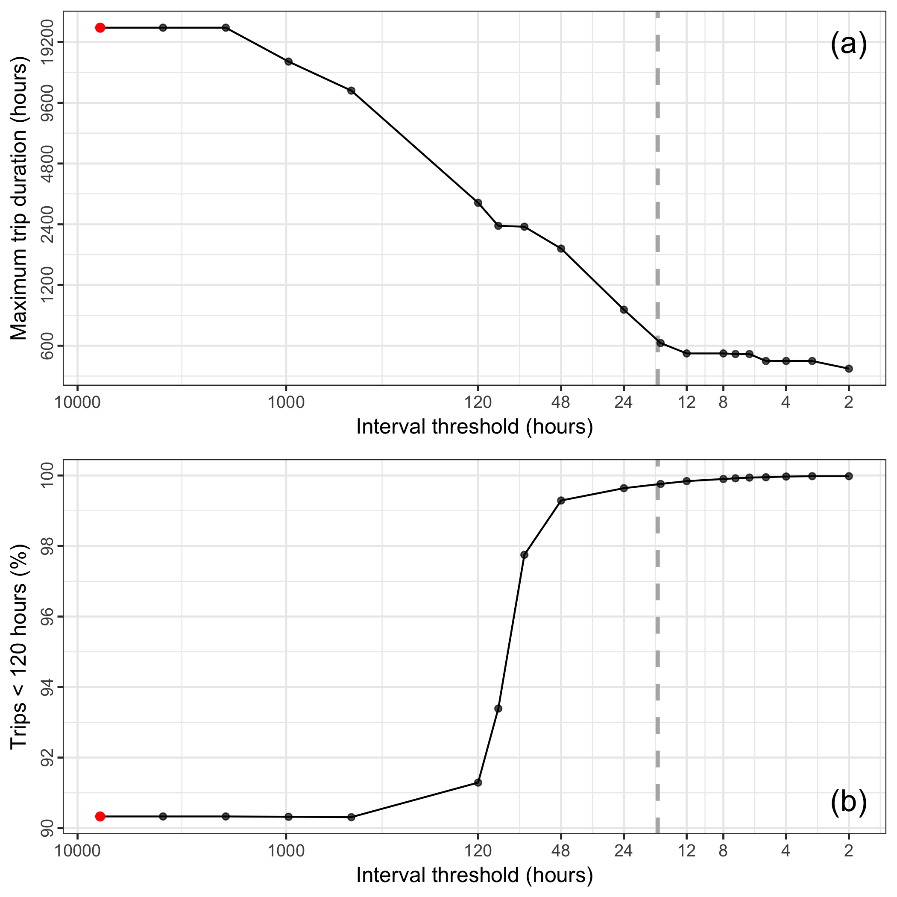{width=100%}


\newpage
## WebFigure 2. Defining impacted vessels based on the amount of fishing effort inside the Jabuka-Pomo closure one year prior to the trawling ban. Per vessel fishing effort inside the closure, as a percentage of total vessel effort, is plotted against vessel fishing hours inside the closure. Impacted vessels were defined as those vessels whose total fishing effort (as a percentage and as total hours) was greater than the 95^th^ percentile. 

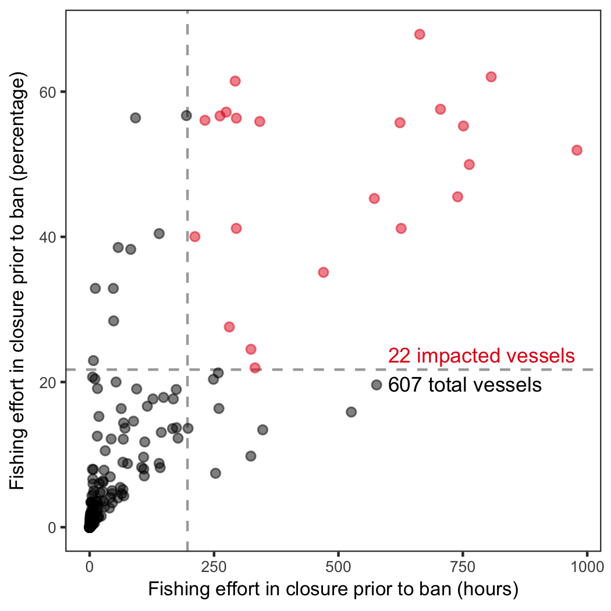{width=100%}

\newpage
## WebFigure 3. Frequency distribution of fishing observations by distance from the Jabuka-Pomo border for impacted vessels (n = 22). The red dashed line represents the threshold used to exclude fishing observations for impacted vessels, and the blue dashed line represents the 99.9^th^ percentile for illustration. 
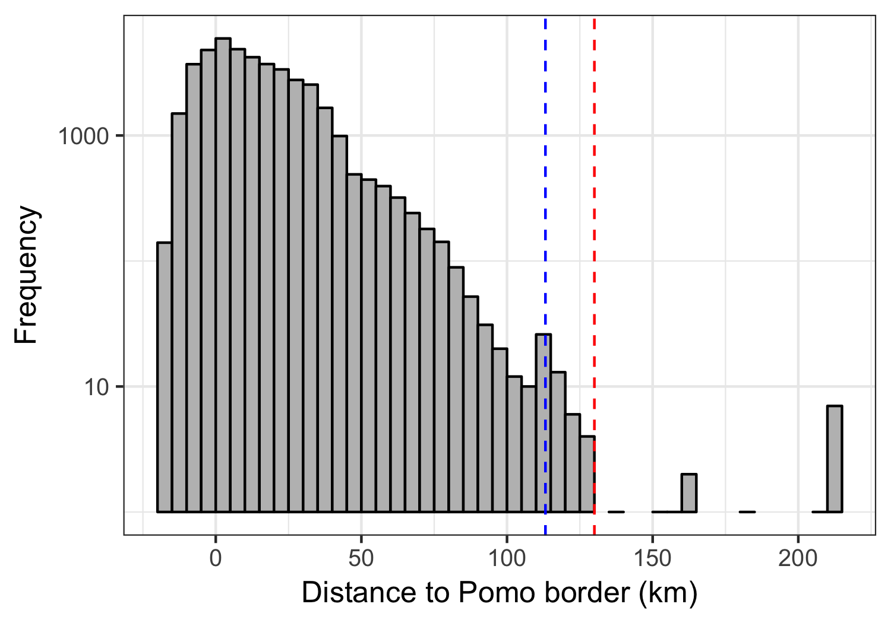{width=90%}

\newpage
## WebFigure 4. Fishing effort of impacted vessels (n = 22) before and after the cessation of trawling in the Jabuka-Pomo closure (represented by the inner black polygon). The outer black polygon represents the defined study area, which do not include fishing observations > 130km from the Jabuka-Pomo border.    

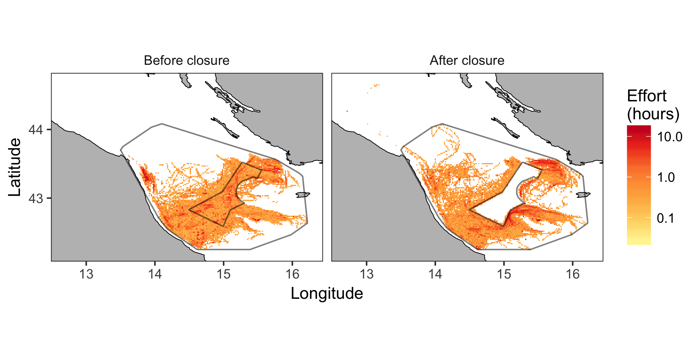{width=90%}


\newpage
## WebFigure 5. Defining the study area and visualizing the spatial distribution of total fishing effort before and after the Jabuka-Pomo closure (inner black polygon) summed across three types of vessels - control, impacted, and other. The outer convex hull polygon was defined by the maximum distance impacted vessels fished from the border of the Jabuka-Pomo closure (see WebPanel 1 - Methods - for more details).

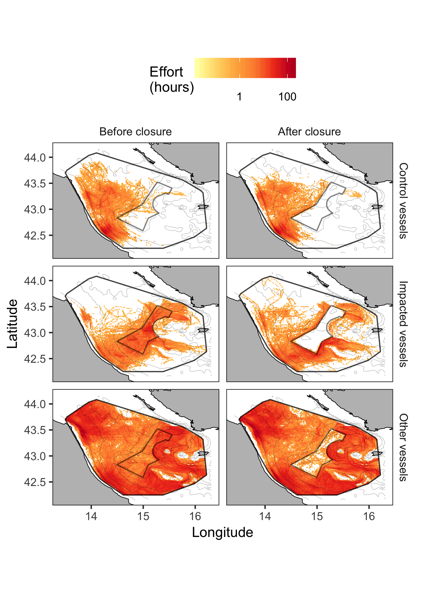{width=90%}

\newpage
## WebFigure 6. Maps of predictors used in the generalized additivel model. The units of distance variables, depth, and bottom slope are km, m, and degrees, respectively.

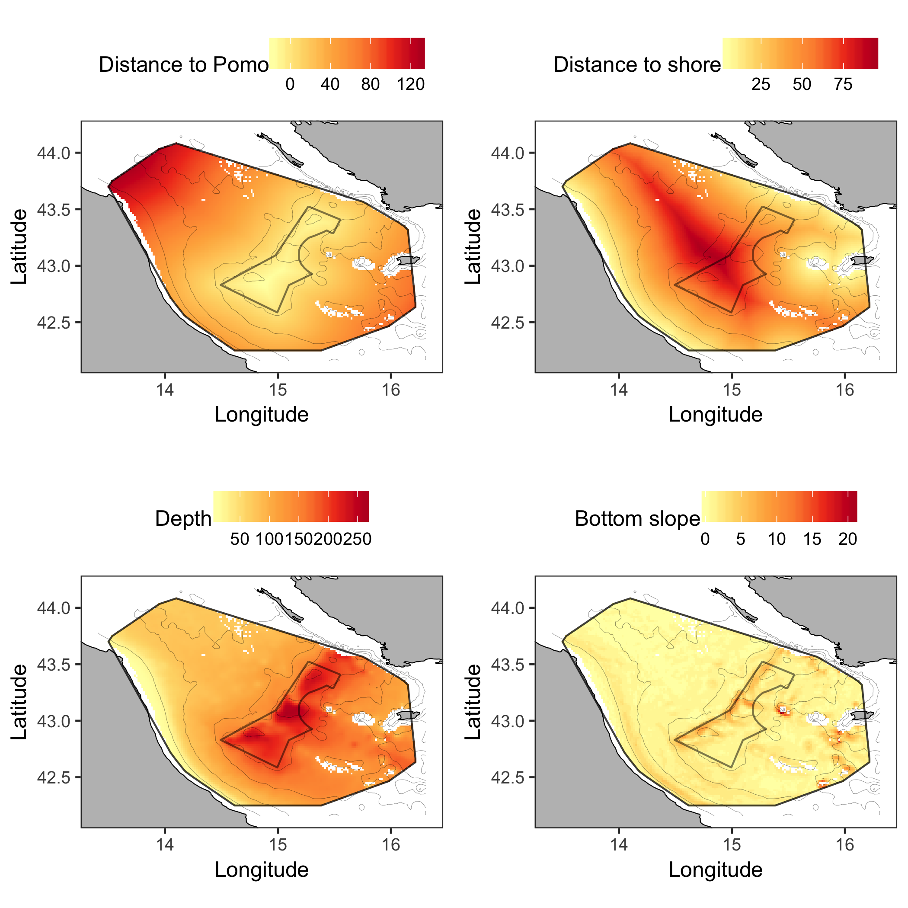{width=100%}

\newpage
## WebFigure 7. Maps of nursery persistence for each of five commercial species; habitat quality is the sum of persistence across all five species (see WebPanel 1 - Methods - for more details). Habitat quality was used as a linear predictor in the generalized additive model.

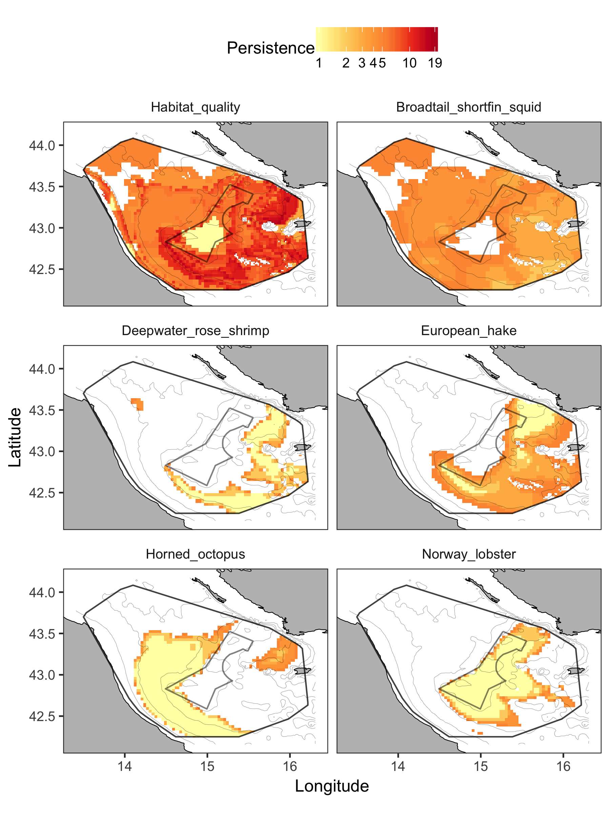{width=90%}

\newpage
## WebFigure 8. Correlation matrix of the predictors used in the generalized additive model.

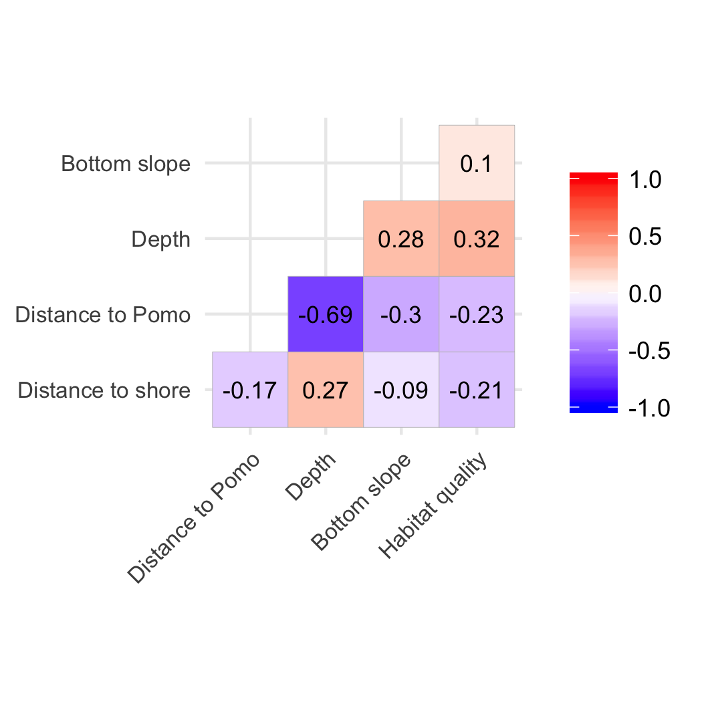{width=100%}

\newpage
## WebFigure 9. Spline correlogram displaying the spatial autocorrelation of the residuals of the generalized additive model. Beyond 10km, spatial autocorrelation is minimal.

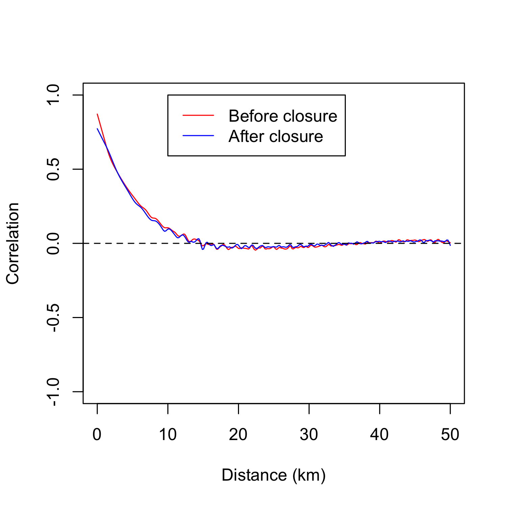{width=100%}

\newpage
## WebFigure 10. Estimated partial contribution to effort for smoothed (a, b) and linear (c, d) terms from the generalized additive model of fishing hours (with 95% confidence intervals) before and after the cessation of trawling in the Jabuka-Pomo closure (Table 1). In (a), the dashed line at 0 indicates the border of the Jabuka-Pomo closure, such that positive distances are outside the closure and negative distances are inside the closure. 

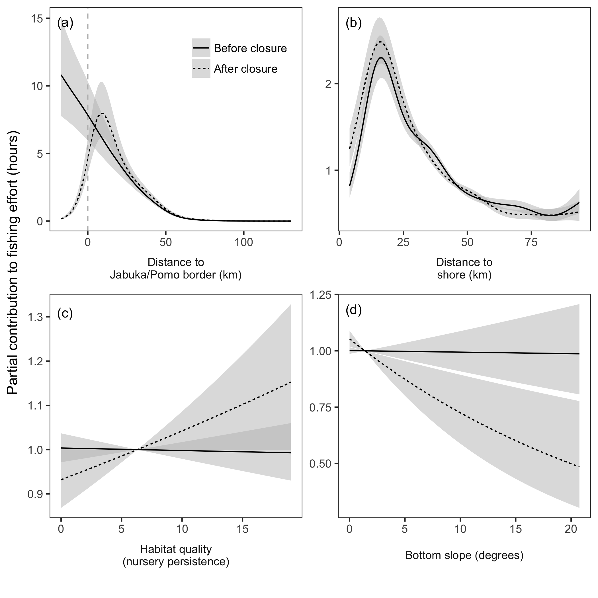{width=100%}

\newpage
## WebFigure 11. Monthly time series (January 2014 - July 2016) of effort inside and outside the Jabuka-Pomo closure, with colors representing the two nations that fished in the study area. The black dashed line represents the official start of the trawling ban (25 July 2015), and the gray dashed lines denote the one year periods before and after the closure used in our analyses. The gray rectangles represent the annual six week trawling suspension imposed on Italian vessels during the summer by the Italian Ministry of Agricultural, Food, and Forestry.

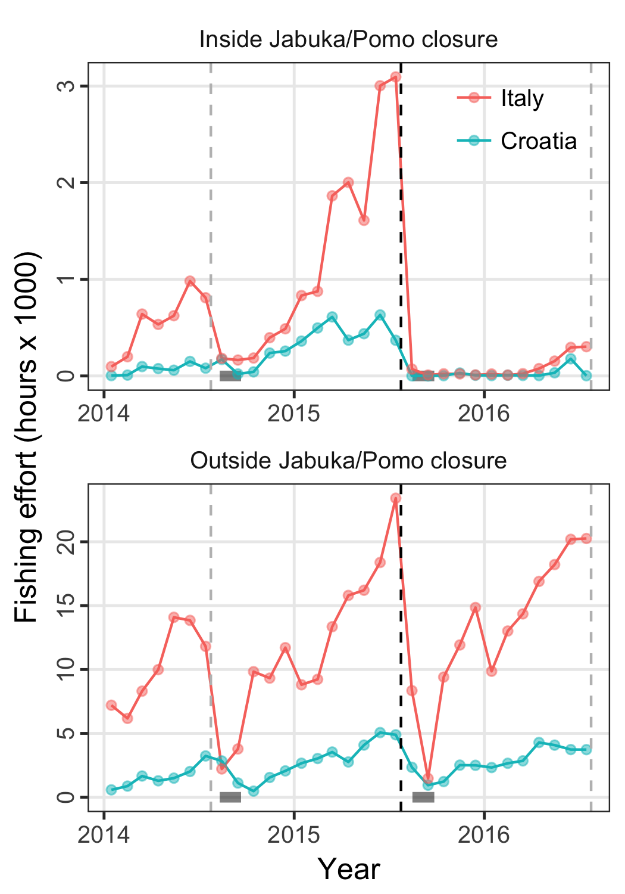{width=75%}

\newpage
## WebFigure 12. Monthly time series (January 2014 - July 2016) of effort inside the Jabuka-Pomo closure. Each panel represents a unique vessel, and vessels are arranged in descending order of the total number of hours fished inside the closure after the trawling ban. Only 22 vessels (of 87) in the upper quartile of total effort inside the closure after the trawling ban (i.e., > 11.3 hours) are displayed; these 22 vessels represents 86% of the incursions (in total hours). The ports associated with each vessel are listed, with the number of fishing hours inside the closure after the trawling ban in parentheses. Colors represent nations, and shapes represent whether vessels were designated as impacted or other. The black dashed line represents the official start of the trawling ban (25 July 2015), and the gray dashed lines denote the one year periods before and after the closure used in our analyses. 

\newpage
## WebFigure 12.
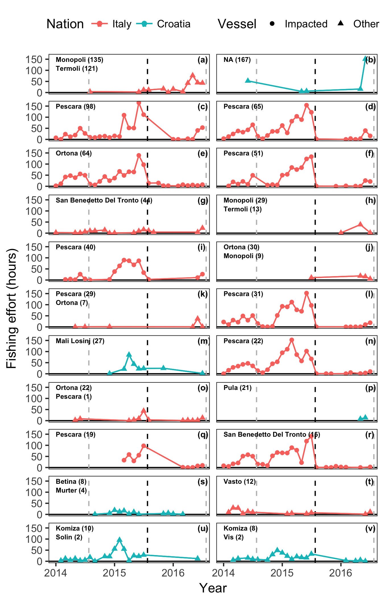{width=100%}

\newpage
## WebFigure 13. Maps of fishing effort for four vessels after the cessation of trawling in the Jabuka-Pomo closure (represented by the black polygon). These four maps (a-d) correspond to the vessels in WebFigure 12 (a-d). The size of points corresponds to the total number of fishing hours inside the closure associated with each port. 

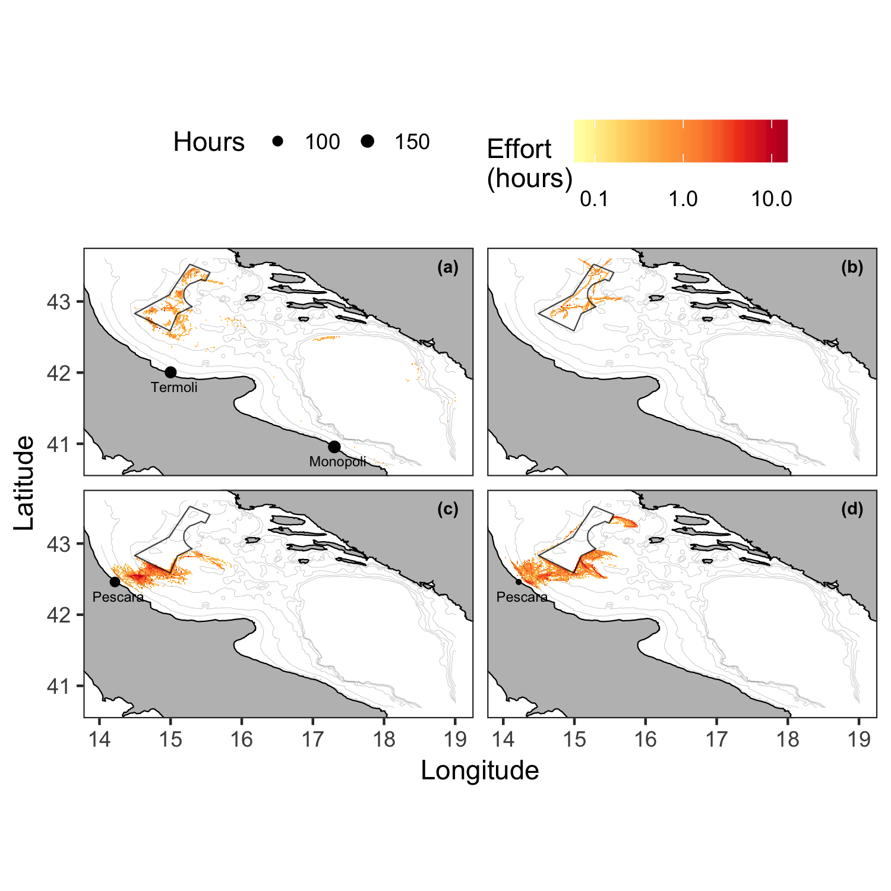{width=100%}

\newpage
## WebReferences

